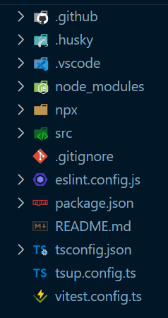

# TS-Hajime 🌸

Effortlessly bootstrap strongly-typed TypeScript npm libraries with minimal configuration and a focus on developer experience.

## 🌟 Features

- **Minimal Setup & Visual Clarity**: Enjoy sensible defaults that keep your project setup clean.
- **Developer-Centric**: Built with tools like `pkgroll`, `tsx`, `tsup`, `vitest`, and `cac`.
- **Comprehensive Configurations**:
  - Use `biome` instead of `eslint` and `prettier` for linting and formatting. (please install `biome` extension in your editor)
  - Preconfigured `tsconfig`, `vitest`, `package.json`, and `.gitignore` files.
  - Ready-to-use GitHub Actions, pre-commit hooks, and npm scripts.
  - Examples and tests included for both library code and `npx` commands.
- **TypeScript npx Commands**: Write `npx` commands directly in TypeScript.
- **ESM & CJS Support**: Outputs both ESM and CJS modules.
- **Optimized for VSCode**: Pre-configured with file nesting, auto-prettify on save, and a specified TypeScript TSDK path.
- **Fully Customizable**: Exposed configurations allow for complete customization to fit your needs.

## 🚀 Getting Started

1. Run the command below to bootstrap your project:

   ```bash
   npx ts-hajime your-app-name-here
   ```

Here’s what your project structure will look like:



2. Replace all occurrences of `my-app` with your app’s name, and `my-description` with a description.

## ⚙️ Key Commands

- **Build**: `npm run build`
- **Test**: `npm test`
- **Lint & Fix**: `npm run lint`
- **Type Check**: `npm run tsc`  
  _(Note: Type checking is automatically done in GitHub Actions as part of the build step with `pkgroll`.)_
- **Try `npx` Command Locally**: `npm run npx something`  
  _(Modify the `npx` script in `package.json` to suit your project requirements.)_

Enjoy coding! 🌸
